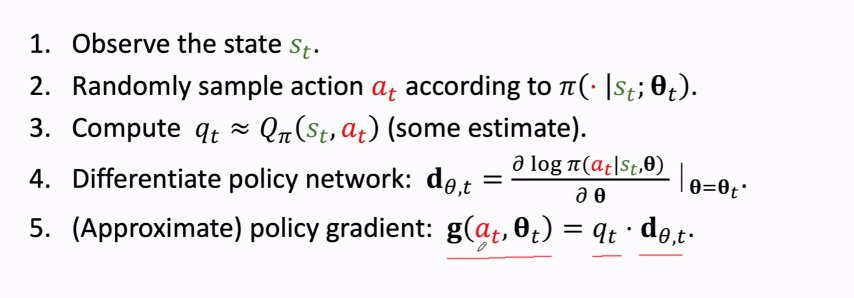

深度强化学习 Value-Based Reinforcement learning
<!--More-->

# Deepl Q Network (DQN)

我们抽象DQN为$(s, a; w)$ to approximate $Q^*(s, a)$， 我们只需要知道Q这个函数就能知道这个我们的选择，对于未来来说哪个更好。但实际上未来不可知，我们通过过去已经知道的内容，来模拟一个先知。这个先知不需要完成任务才能更新，通过TD算法，运行到一半也能更新这个Q。等到最后收敛或者训练结束，我们就获得了一个Q的近似
在这个体系中，因为Q是”未来的“最好的选择，所以我们肯定会听从先知的话，所以这里只需要选择价值最高的

TD learning for DQN

TD算法不需要完全完成任务也能更新模型。

$Q(a_t, s_t) = r_t + Q(a_{t+1}, s_{t+1})$ 来更新参数，其中，只有$r_t$是真实值，剩下两个是预测值。

# Policy Based RL

我们在这个体系中需要学得一个策略表， 我们使用Policy Network来学， 当我们学好了一个次略函数之后，我们每次运行都通过这个策略函数来采样

策略和为$1$这是一个概率密度函数

我们在这里考虑State-value function , 这时候只和两个变量有关系，如果$s$是固定， 如果$\pi$比较好，那么state-value function 就比较好，反之则比较差。

这时候，如果我们是以神经网络的方法得到V, 我们可以对S求期望，这样就固定了s，这样就只剩下了对策略的评价，也就是这个网络的参数。

在这里我们可以使用梯度上升， $\theta = \theta + f^'*lr$

一下我们对这个进行一些基本的数学推导。首先，我们知道$V(s;\theta)=\sum_a\pi(a|s;\theta) * Q_(\pi)(s, a)$

对其进行求到，用来更新参数, 在假设$Q$和$\theta$无关, 并不严禁
$$
\begin{aligned}
\frac{dV(s;\theta)}{d\theta}
&=\frac{\sum_a\pi(a|s;\theta) * Q_(\pi)(s, a)}{d\theta}\\
&=Q_{\pi}(s, a) * \sum_a\frac{d\pi(a|s;\theta)}{d\theta}\\
&=Q_{\pi}(s, a) * \sum_a\pi(a|s;\theta)*\frac{d\log\pi(a|s;\theta)}{d\theta}\\
&=E_A[Q_{\pi}(s, a)*\frac{d\log\pi(a|s;\theta)}{d\theta}].
\end{aligned}
$$

对于离散动作，我们只用使用原始的代数式将所有哥哥动作加起来，就算出总的策略网络的导数

对于连续动作，我们可以用推导出来的代数式算出他的导数, 这时需要定积分，因为难以计算出结果，我们使用蒙特卡洛模拟

通过概率密度函数来进行抽样，把连续的变成了离散的， 我们随机抽的是无偏估计。

在这里如何求得q是关键问题

+ 第一种玩完一局游戏再进行更新，这样就能知道未来能发生什么了

+ 第二种方法是使用神经网络近似q

# actor-critic methods

使用地一个Policy network (actor): 训练模型，使用$\theta$作为参数，去近似策略函数， 同时，训练q来近似价值函数，然后用q来给每次我们策略函数产生的选择打分

策略网络的输入是stage， 价值网络是stage， value， 可以共享一部分参数

